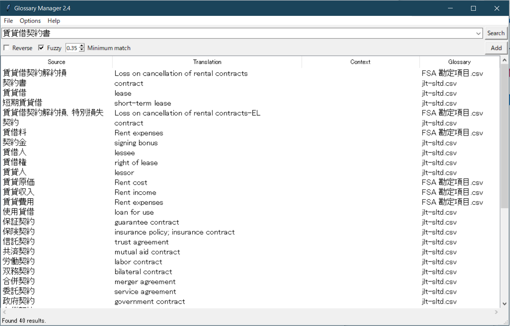
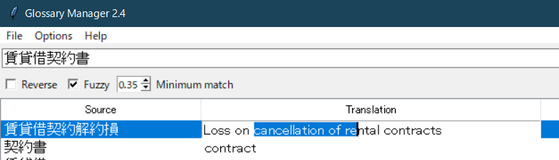

# GLOSSARY MANAGER GUI
This is a graphical version of my earlier glossary manager project. It uses a TKinter GUI to search and display results from any number of glossaries read from a simple .csv or .xlsx file.  
It allows both literal and fuzzy searching of glossaries in any language pair (full unicode support), as shown below.

### Adding terms
There is a dedicated UI for adding new terms to the glossary.

### Editing terms
There is also an Excel-like functionality for editing the glossary entries in place.

### Retrospective
This was a big step up from the original CLI glossary manager and I am proud of how it came out. In particular, the fuzzy search and the spreadsheet-style editing function were good ideas and I think I executed them well. The fact that the compiled release still works on Windows 11 after all these years is a nice bonus.  
Ultimately this program has not been very useful, as I finished working on it just before leaving the firm. As a freelancer I could use more full-featured CAT tools which made this minimal glossary manager somewhat redundant. However, it does what it does perfectly well, and to be honest it is still much snappier than memoQ or Trados on my machine. A resounding success.
